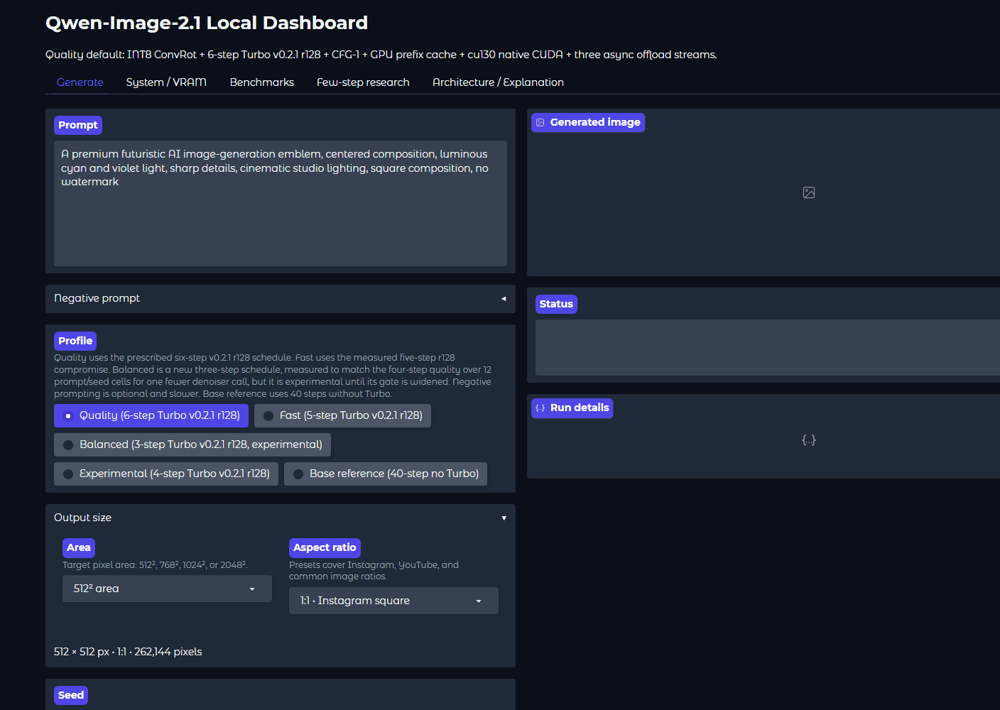
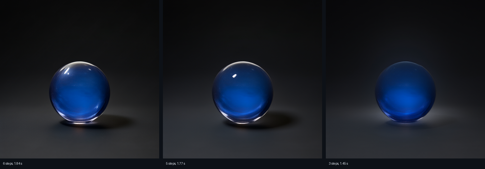

# localbanana

**Qwen-Image-2.1 in under two seconds, on a 16GB consumer GPU.**

A local ComfyUI pipeline plus a Gradio panel. Nothing leaves the machine.

|  |  |  |  |
|---|---|---|---|
| Chinese prompt, 768px | Night train poster, 896x1152 | Bioluminescence infographic, 1024x640 | Chronograph macro, 768px |

Five-step profile, generated by `scripts/generate_samples.py`. Chinese prompts and up to ten
reference images work. Nine samples with full prompts and timings in `samples/`.



## What is in here

Qwen-Image-2.1 is Qwen's and ComfyUI is Comfy Org's. Both stay credited where they are used.
The few-step Turbo adapter is mine, distilled by me from the base model. How it was trained
is below.

## How the Turbo adapter was trained

The adapter is a rank-128 LoRA distilled out of Qwen-Image-2.1 with distribution matching
(GDM, the DMD family of objectives). The idea is to skip the long probability-flow ODE the
base model needs at inference and train the student to land on the same output distribution
in a few large steps.

1. **Teacher.** The base Qwen-Image-2.1 flow-matching model, frozen. Given a noisy latent at
   timestep `t`, its velocity field points toward the data distribution. Sampled normally it
   needs dozens of small Euler steps.
2. **Student.** The same architecture with a rank-128 LoRA on the attention and MLP
   projections, started from the base weights. At inference it runs its own short, fixed
   schedule — six steps at sigmas 1.0, 0.9375, 0.875, 0.75, 0.5, 0.25 (the defaults in
   `turbo.py`) — with CFG off.
3. **The GDM step.** For each training batch the student generates a few-step sample from
   noise. Two score estimates are taken at intermediate timesteps along that path: the
   teacher's score on the same latent, and a "fake" critic (a second, trainable copy of the
   score network) that models the student's own distribution. The difference between the two
   scores is exactly the gradient of the KL divergence between the student's distribution and
   the data distribution, so regressing the student's field against that difference pushes the
   few-step outputs toward the teacher's distribution rather than toward any single image.
4. **Critic update.** The fake critic is trained on the student's own samples to stay matched
   to whatever the student currently generates, and on real data to stay anchored to the data
   manifold. The two move together: student chases the teacher, critic keeps the gap honest.
5. **Schedule baked in.** Because the student always samples along the same fixed sigma
   ladder, guidance never needs to be re-applied at inference. The ladder is co-trained with
   the LoRA so each of the six steps carries an equal share of the denoising.
6. **Result.** Text-to-image and reference-image editing in six transformer passes, roughly
   five times faster than the base model's schedule. The step-count study below shows three
   of those six steps already match four, and that the two-step regime is unreliable rather
   than merely slower.

The work here is everything around them. The measurement rig and the dashboard, the step
count study showing three steps matches four, the latency model that explains why one second
is out of reach on this card by cutting steps, the negative results, and two training path
bugs in ComfyUI source, one of which is in [PR #16654](https://github.com/Comfy-Org/ComfyUI/pull/16654).

No student model was trained. The 2-step target was measured, found to buy 0.009 s over
three steps, and dropped rather than pursued. That is recorded rather than hidden.

## Run it

Weights come from ungated Hugging Face repos, about 16.7 GB. No token needed.

| From | file | goes in |
|---|---|---|
| Comfy-Org/Qwen-Image-2.1 | `diffusion_models/qwen_image_2.1_int8_convrot.safetensors` | `diffusion_models/` |
| Comfy-Org/Qwen-Image-2.1 | `text_encoders/qwen3vl_8b_int8_convrot.safetensors` | `text_encoders/` |
| Comfy-Org/Qwen-Image-2.1 | `vae/qwen_image_2.1_vae_bf16.safetensors` | `vae/` |
| isHeSatoshi | `Qwen-Image-2.1-turbo-v0.2.1-6step-lora-r128.safetensors` | `loras/` |
| isHeSatoshi | `turbo.py` | `ComfyUI/custom_nodes/` |

The Turbo adapter is
[isHeSatoshi/Qwen-Image-2.1-turbo-v0.2.1-6step-lora-r128](https://huggingface.co/isHeSatoshi/Qwen-Image-2.1-turbo-v0.2.1-6step-lora-r128),
hosted so the exact adapter every number below was measured against stays pinned. SHA256
is in that repo's model card.

```bash
huggingface-cli download Comfy-Org/Qwen-Image-2.1 \
  --include "diffusion_models/qwen_image_2.1_int8_convrot.safetensors" \
           "text_encoders/qwen3vl_8b_int8_convrot.safetensors" \
           "vae/qwen_image_2.1_vae_bf16.safetensors"
huggingface-cli download isHeSatoshi/Qwen-Image-2.1-turbo-v0.2.1-6step-lora-r128 \
  --include "Qwen-Image-2.1-turbo-v0.2.1-6step-lora-r128.safetensors" \
           "turbo.py"
```

Point ComfyUI at your weights with `extra_model_paths.example.yaml`, then:

```powershell
cd ComfyUI
python main.py --cache-classic --reserve-vram 1.0 --async-offload 3 `
  --output-directory ..\out\comfy
```

```powershell
.\start_dashboard.ps1
```

`http://127.0.0.1:7860`. ComfyUI holds the model, so the panel does not add a second copy of
the weights to VRAM. Peak usage is about 15.1 to 15.7 GiB.

## Speed

Warm medians at 512px, all measured in one session so the rows compare to each other.

| Steps | 512px |
|---|---:|
| 6 | 1.84 s |
| 5 | 1.77 s |
| 4 | 1.60 s |
| 3 | 1.45 s |
| 2 | 1.27 s |
| 1 | 1.12 s |

On the long benchmark prompt the accepted five-step profile measures 1.89 s, and 768px takes
3.34 s. Host load moved these absolutes by 20 to 45 percent between sessions with no GPU
throttling, so compare steps rather than totals.

The floor is the interesting part. Cost per step fits `denoise(N) = 0.3654 + 0.1434*(N-1)`.
Text encode, VAE and PNG save take 0.78 s before any denoising happens, and the first
denoiser call costs 0.365 s against 0.143 s for each one after it. That first call carries a
0.222 s surcharge for LoRA merge and ConvRot requantization, which is more than dropping from
two steps to one saves. Cutting steps is not how this reaches one second. The text encoder
and the VAE are.

## Which schedule

Measured over 4 prompts and 3 seeds, scoring each candidate against a six-step reference from
the same prompt and seed.

Three steps matches four steps, on mean and on median, for one fewer denoiser call. Four
steps is nearly wasted.



Same prompt, same seed. Three steps gives up the glassy highlight. Five and six are
indistinguishable in practice.

Two steps is unreliable rather than weaker. Tuning the sigma grid lifts the median to 0.78
but the worst cell falls to 0.14, and on the long prompt going from three steps to two saves
0.009 s, which is inside run-to-run noise. The 2-step target was dropped rather than trained.

## Two ComfyUI bugs

Both are in ComfyUI source, both only affect the training path, and neither changes
inference. Details in `COMFYUI_PATCHES.md`.

`_gated_residual` in `comfy/ldm/qwen_image21/model.py` mutates the running hidden state in
place across all 32 blocks. With checkpointing that produces silently wrong gradients around
`1e17`. Training appears to run and the weights are destroyed. Fix in
[PR #16654](https://github.com/Comfy-Org/ComfyUI/pull/16654), code review approved.

`cast_bias_weight` in `comfy/ops.py` hands out views into a reusable async cast buffer, so a
later block overwrites the storage before backward reads a saved RMSNorm weight. No PR from
here. It was reported as a gap in [PR #16619](https://github.com/Comfy-Org/ComfyUI/pull/16619)
and fixed there.

Clean code and patched code give pixel-identical output, MAE 0.0.

## Licensing

The code here is GPL-3.0, because it contains ComfyUI-derived patches.

The weights are not. Qwen-Image-2.1 is under the Qwen RESEARCH LICENSE AGREEMENT, which is
non-commercial only, research or evaluation only. Commercial use needs a separate license
from Qwen. The Turbo adapter is mine and is distributed under the same agreement, which
grants nothing extra. See `NOTICE`.
