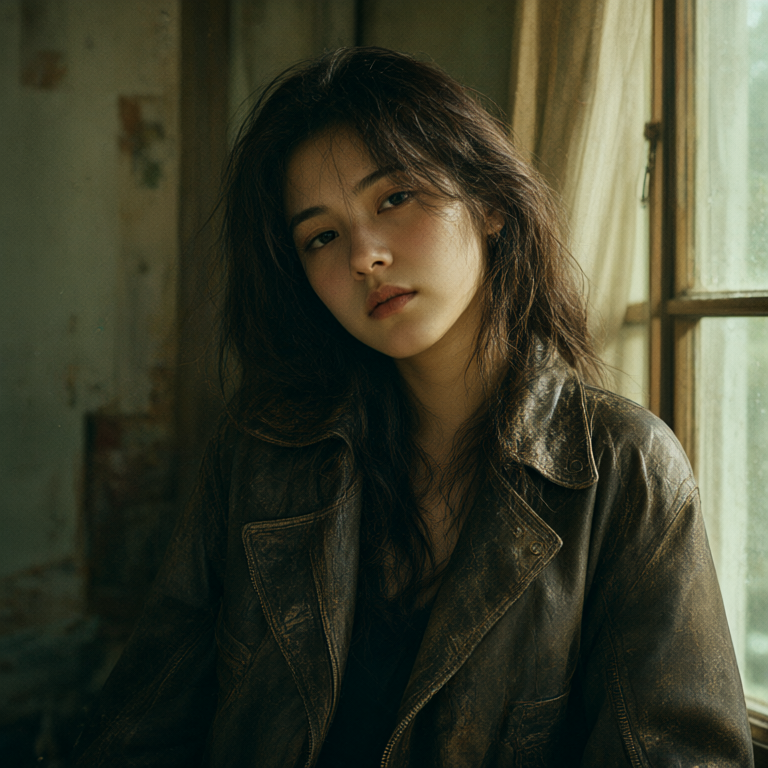
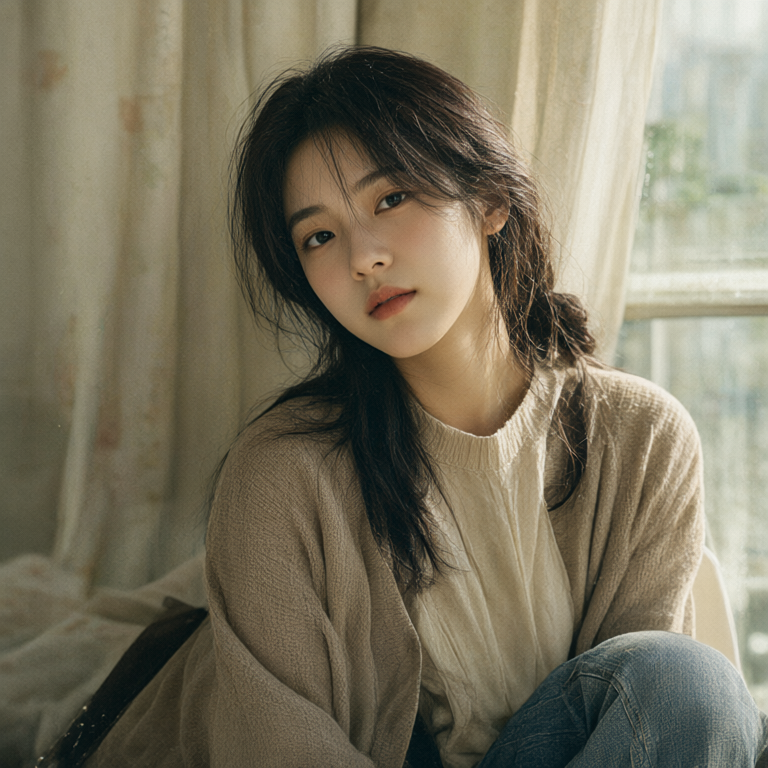
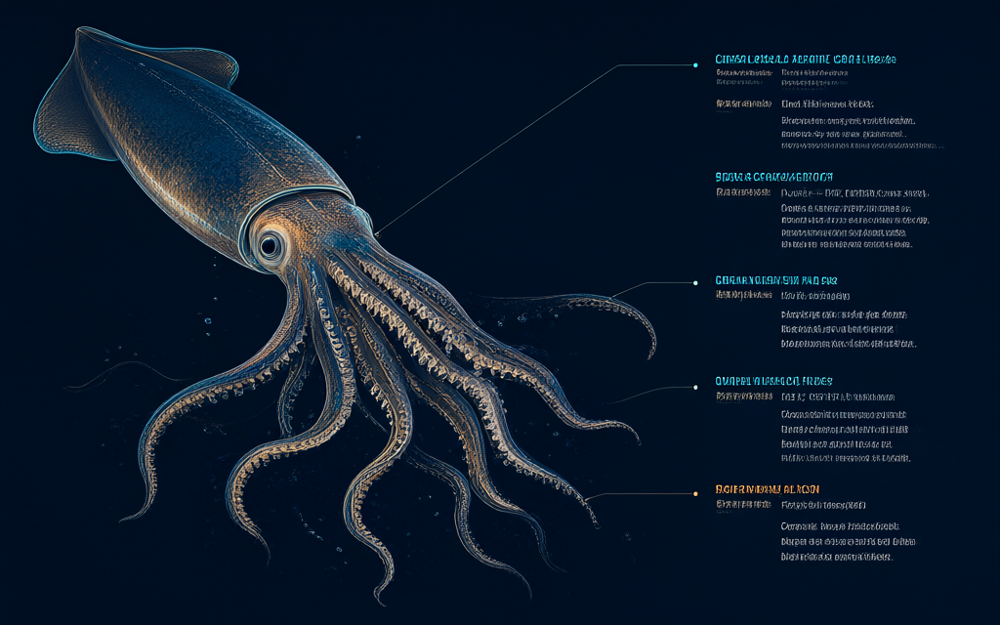
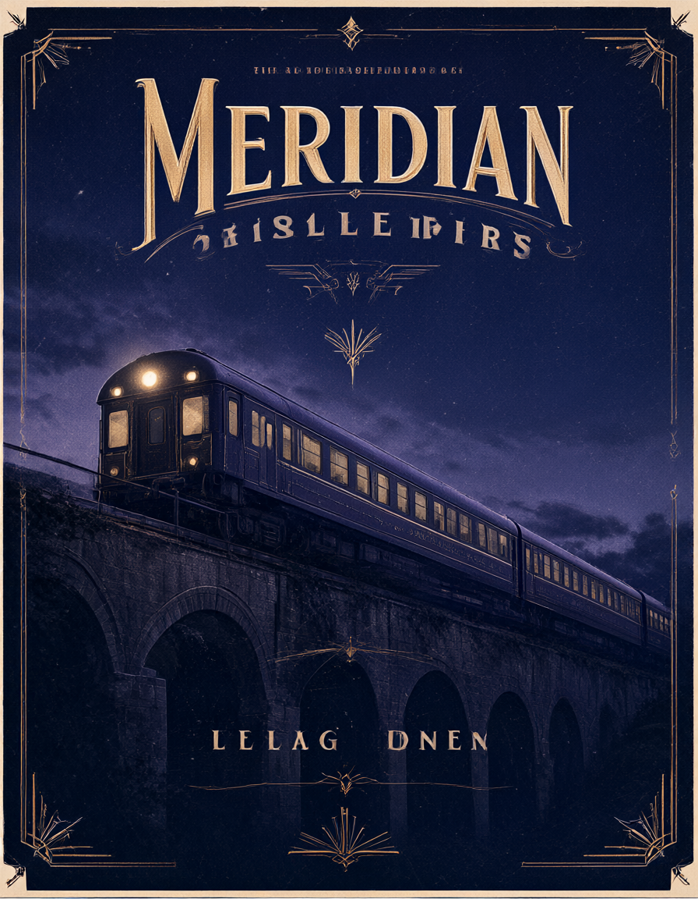
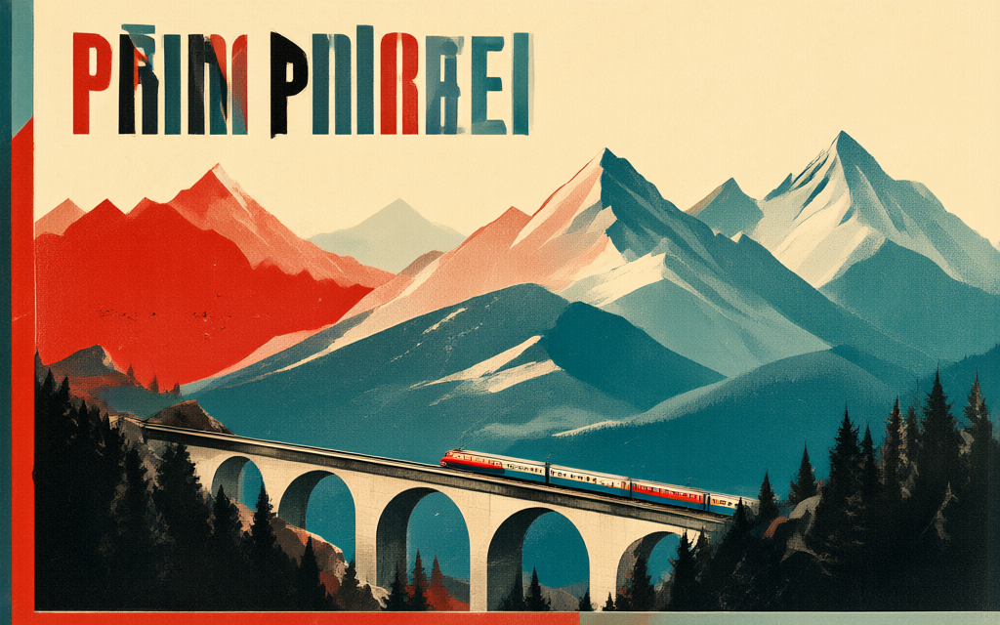
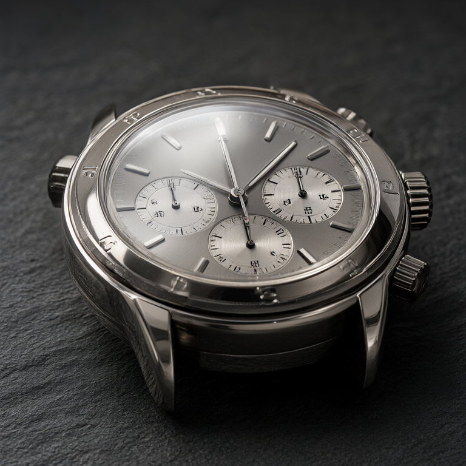
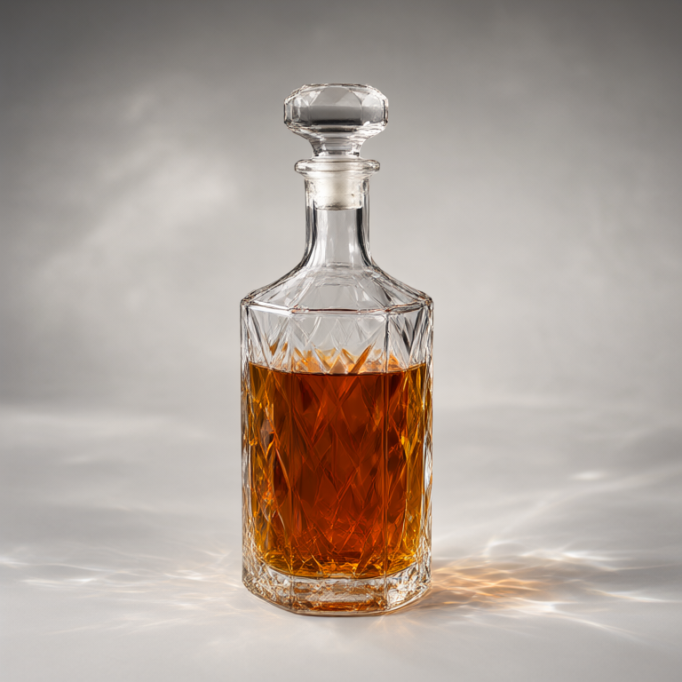
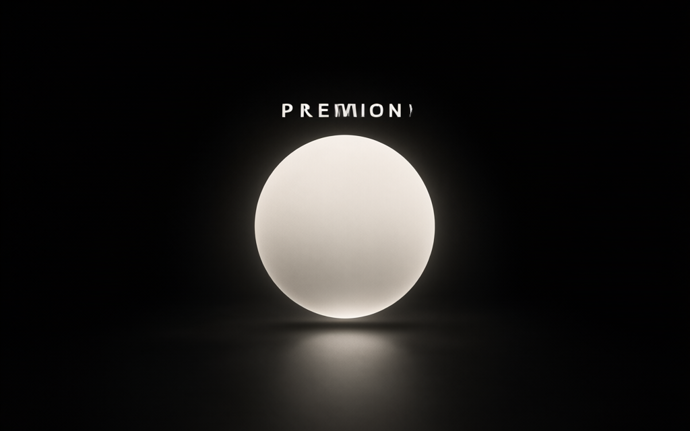
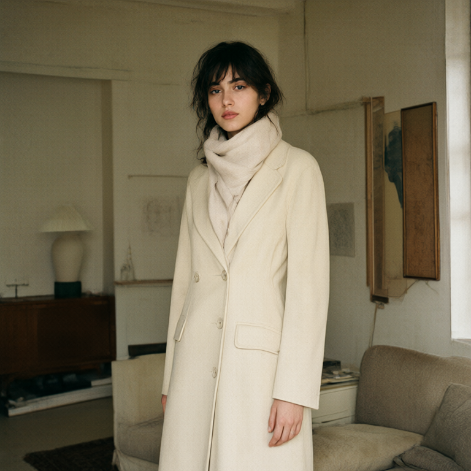

# Sample gallery

Every image here was produced by the code in this repository, through the same
`ComfyClient` and `build_graph` the dashboard uses. Prompt, seed, profile, and measured wall
time for each one is in `manifest.json`, and the whole set regenerates with:

```bash
python scripts/generate_samples.py
```

All of them use the five-step fast profile, which is the one that holds the sub-two-second
claim. Seeds were picked by generating three per prompt and keeping the strongest. The times
are 768px and up, which is why they run 5 to 10 s rather than the 512px figures in the
top-level README.

| Prompt | Result | Size | Time |
|---|---|---|---:|
| Cinematic photorealistic film portrait, Kodak Portra grain, muted teal and amber |  | 768x768 | 5.3 s |
| 生成一张电影感写实人像，柔和自然光与暖色调，浅景深，韩系都市偶像剧质感，细腻胶片颗粒 |  | 768x768 | 4.9 s |
| Deep-sea bioluminescence infographic, giant squid cutaway with leader lines |  | 1024x640 | 10.2 s |
| Travel poster for a fictional night train called the Meridian, art-deco |  | 896x1152 | 7.1 s |
| 1960s Swiss railway screenprint poster, four-colour, halftone |  | 1024x640 | 8.6 s |
| Steel chronograph on dark slate, macro studio light, sharp detail |  | 768x768 | 7.0 s |
| Faceted crystal decanter with amber liquid, softbox caustics |  | 768x768 | 6.4 s |
| Minimalist launch graphic, one luminous sphere over matte black |  | 1024x640 | 6.0 s |

## Reference image

The last sample conditions on the first one. `reference-wardrobe-change.png` is generated
from `portrait-film-grain.png` with the prompt "the person from the reference photo is now
wearing a tailored cream wool coat, standing in the same room, same lighting, same film
grain". The face, the room, and the lighting carry across.

| Reference | Prompt | Result | Size | Time |
|---|---|---|---|---:|
|  | The person from the reference photo is now wearing a tailored cream wool coat, standing in the same room |  | 768x768 | 5.8 s |

The dashboard accepts up to ten reference images. Prompting in Chinese works, as the second
sample shows. Text inside images is approximate rather than exact, which is normal for this
class of model.
